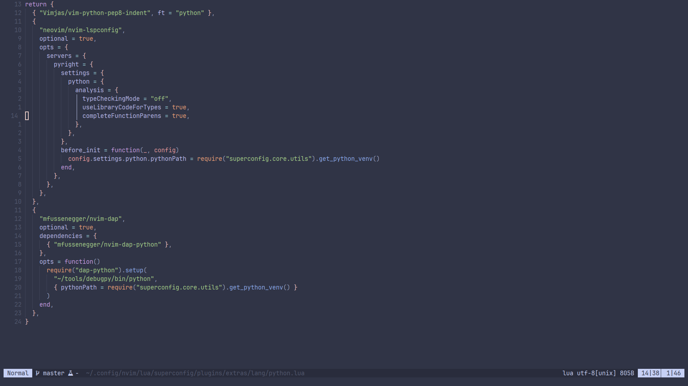

Neovim config
=============

---

# Features
 - Fast startup
 - Functionality, but lightweight
 - Nice color scheme for long working hours
 - Fuzzy finder for projects, files, buffers, and live grep
 - Integrated Development Environment (IDE) Features: LSP, DAP, formatting
 - Git features
 - Obsidian integration
 - Discord integration

# Inspired by
 - [mini.nvim](https://github.com/echasnovski/mini.nvim)
 - [Helix Editor](https://helix-editor.com/)
 - [LazyVim](https://github.com/LazyVim/LazyVim)
